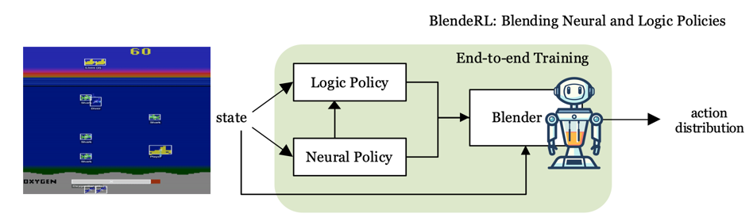

# BlendeRL: Blending Neural and Logic Policies
<!-- This is the implementation of **Neurally gUided Differentiable loGic policiEs (NUDGE)**, a framework for logic RL agents based on differentiable forward reasoning with first-order logic (FOL).
 -->



## Quickstart
Install `nsfr` and `nudge`.

Training script:
```
python train_blenderl.py --track --pretrained --num-steps=512 
```
- --track: activate wandb tracking
- --pretrained: use a pretrained neural agent
- --num-steps: the number of steps for policy rollout
<!--
1. Install all requirements via
    ```bash
    pip install -r requirements.txt
    ```
2. On project level, simply run `python train.py` to start a new training run.
-->
Play script:
```
python play_gui.py
```
## How to Use
### Hyperparameters
The hyperparameters are configured inside `in/config/default.yaml` which is loaded as default. You can specify a different configuration by providing the corresponding YAML file path as an argument, e.g., `python train.py in/config/my_config.yaml`. A description of all hyperparameters can be found in `train.py`.

### The Logic
Inside `in/envs/[env_name]/logic/[ruleset_name]/`, you find the logic rules that are used as a starting point for training. You can change them or create new rule sets. The ruleset to use is specified with the hyperparam `rules`.

### Install Locally
If you want to use NUDGE within other projects, you can install NUDGE locally as follows:
1. Inside ```nsfr/``` run
    ```bash
    python setup.py develop
    ```
2. Inside ```nudge/``` run
    ```bash
    python setup.py develop
    ```

### Ohter dependencies
1. Install packages by `pip install -r requirements.txt` 

2. PyG and torch-scatter for neumann
Install PyG and torch-scatter packages for neumann reasoner. See the [installation guide](https://pytorch-geometric.readthedocs.io/en/latest/notes/installation.html). These should be consistent in terms of ther versions, e.g.
    ```
    pip install torch==1.12.0+cu116 torchvision==0.13.0+cu116 -f https://download.pytorch.org/whl/torch_stable.html
    pip install torch_geometric
    pip install pyg_lib torch_scatter torch_sparse -f https://data.pyg.org/whl/torch-1.12.0+cu116.html
    ```

### Playing
TODO

**Example to play with a trained ppo agent**

```
python3 play.py -s 0 -alg ppo -m getout -env getout  
```


## Environments and their Variants
### Getout
* `getout` contains key, door and one enemy.  
* `getoutplus` has one more enemy.
### Threefish
* `threefish` contains one bigger fish and one smaller fish.
* `threefishcolor` contains one red fish and one green fish. agent need to avoid red fish and eat green fish.
### Loot
* `loot` contains 2 pairs of key and door.  
* `lootcolor` contains 2 pairs of key and door with different color than in loot.  
* `lootplus` contains 3 pairs of key and door.


## How to Set up New Environments
You add a new environment inside `in/envs/[new_env_name]/`. There, you need to define a `NudgeEnv` class that wraps the original environment in order to do
* **logic state extraction**: translates raw env states into logic representations
* **valuation**: Each relation (like `closeby`) has a corresponding **valuation function** which maps the (logic) game state to a probability that the relation is true. Each valuation function is defined as a simple Python function. The function's name must match the name of the corresponding relation.
* **action mapping**: action-predicates predicted by the agent need to be mapped to the actual env actions

See the `freeway` env to see how it is done.